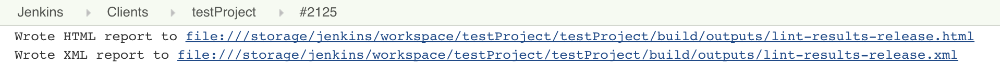
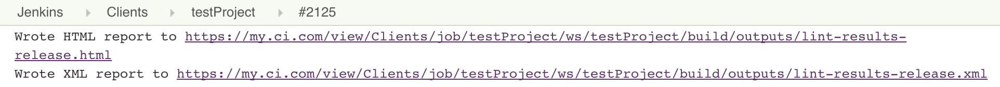

   chrome-jenkins-relative-links
========================

[](https://chrome.google.com/webstore/detail/mhdpelbikeadhkopckfnfofkghioembf)
---------
Display web-accessible links in Jenkins jobs console.

Without this extension, links in a Jenkins job console would point to local files inside the CI node workspace.


This extension replaces the first part of these links with the job URL. 
This allows an authenticated user to access the content of these files, for example reports, directly from the console link.


##Development

You need to have NodeJS with `grunt-cli` and `bower` installed.

```shell
$ npm install -g grunt-cli bower
$ npm install
$ bower install
```

To debug the application with a live reload mechanism, run:

```shell
$ gulp watch
```

Then add the `app` folder as an unpacked extension in Chrome.

##License

```
   Copyright 2016 Daniele Bonaldo

   Licensed under the Apache License, Version 2.0 (the "License");
   you may not use this file except in compliance with the License.
   You may obtain a copy of the License at

     http://www.apache.org/licenses/LICENSE-2.0

   Unless required by applicable law or agreed to in writing, software
   distributed under the License is distributed on an "AS IS" BASIS,
   WITHOUT WARRANTIES OR CONDITIONS OF ANY KIND, either express or implied.
   See the License for the specific language governing permissions and
   limitations under the License.

```
